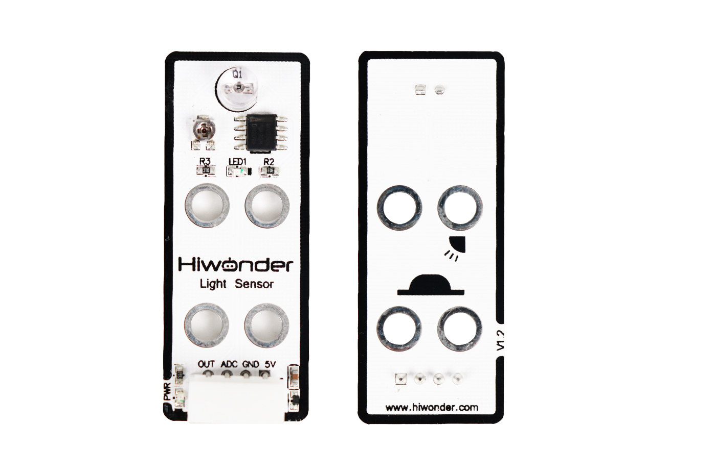
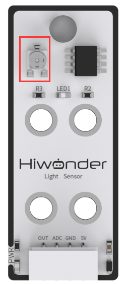
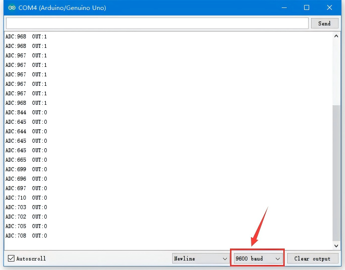

# 1. Knob Sensor Manual

## 1.1 Knob Sensor Description

### 1.1.1 Sensor Introduction

This knob sensor can be used with various modules to achieve different functions, such as controlling fan speed or adjusting light brightness. The sensor board features a user-friendly rotation arrow mark design.

### 1.1.2 Working Principle

The sensor consists of a simple potentiometer. By adjusting the knob, the resistance value is changed within a certain range, thereby changing the output voltage. When using the sensor: Connect the 5V and GND pins to a DC 5V power supply and the ADC pin outputs 0–5V voltage.

## 1.2 Notice

1.  Do not exceed the rated voltage range during use.

2.  Do not use materials that transmit visible light or infrared light as test objects.

3.  Avoid strong light exposure and do not block the light reaching the sensor during use.

4.  Do not operate the sensor in humid environments.

5.  Parameters such as sensitivity and trigger delay should be configured according to the specific application scenario. During testing, sensitivity can be adjusted to accommodate different light intensities and ensure stable sensor performance.

## 1.3 Specifications

For more information, you may refer to **["Knob sensor schematic"](https://drive.google.com/drive/folders/1vS_nRnxwBK2zTQlUL78Xl1KsjsAtdDwG?usp=sharing)**

### 1.3.1 Pin Instruction

| **Pin** | **Instruction**                                                                                                                                                                                                                                                                                                                  |
|:--------|:---------------------------------------------------------------------------------------------------------------------------------------------------------------------------------------------------------------------------------------------------------------------------------------------------------------------------------|
| 5V      | Power Input                                                                                                                                                                                                                                                                                                                      |
| GND     | Ground                                                                                                                                                                                                                                                                                                                           |
| ADC     | The sensor output pin outputs an analog level, and the analog level depends on the knob's angular position. For example, if the ADC has a 10-bit sampling accuracy and an Arduino UNO is used, the analog level range is 0-1023. At this point, if the knob is rotated clockwise, the output analog level increases accordingly. |
| NC      | None                                                                                                                                                                                                                                                                                                                             |

### 1.3.2 Specifications

<table class="docutils-nobg" border="1">
<colgroup>
<col style="width: 50%" />
<col style="width: 50%" />
</colgroup>
<tbody>
<tr>
<td colspan="2" style="text-align: center;">
<strong>Light Sensor</strong>
</td>
</tr>
<tr>
<td style="text-align: center;">
<strong>Parameter</strong>
</td>
<td style="text-align: center;">
<strong>Specification</strong>
</td>
</tr>
<tr>
<td style="text-align: center;">
<strong>Power Supply</strong>
</td>
<td style="text-align: center;">
<strong>DC 5V</strong>
</td>
</tr>
<tr>
<td style="text-align: center;">
<strong>Operating Current</strong>
</td>
<td style="text-align: center;">
<strong>5mA</strong>
</td>
</tr>
<tr>
<td style="text-align: center;">
<strong>Indicator Light (PWR) Description</strong>
</td>
<td style="text-align: center;">
<strong>The PWR LED lights up when powered.</strong>
</td>
</tr>
<tr>
<td style="text-align: center;">
<strong>Connector Type</strong>
</td>
<td style="text-align: center;">
<strong>5264-4AW</strong>
</td>
</tr>
<tr>
<td style="text-align: center;">
<strong>Product Dimensions</strong>
</td>
<td style="text-align: center;">
<strong>50mmx20mm</strong>
</td>
</tr>
<tr>
<td colspan="2" style="text-align: center;">
<strong>Modular installation, compatible with Lego series.</strong>
</td>
</tr>
</tbody>
</table>

## 1.4 Project Outcome

You can refer to the case tutorials and programs for different platforms in the same directory as this tutorial. This section will demonstrate the testing effect using Arduino IDE as an example.

Rotate the potentiometer on the sensor to see the data change on the monitor. Rotate the knob clockwise to increase the displayed value; rotate it counterclockwise to decrease the value.

