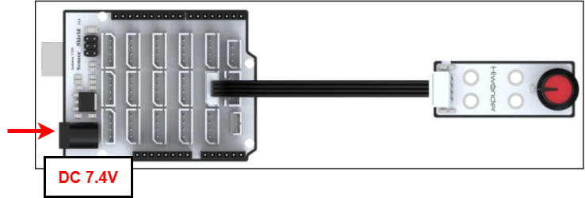
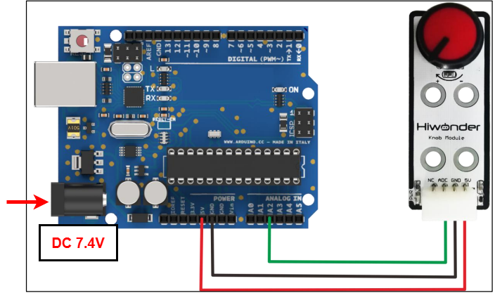
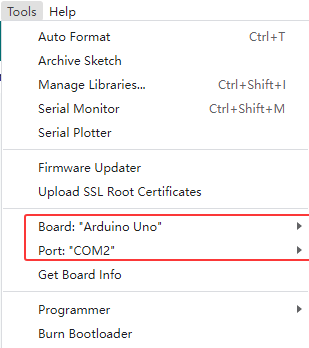
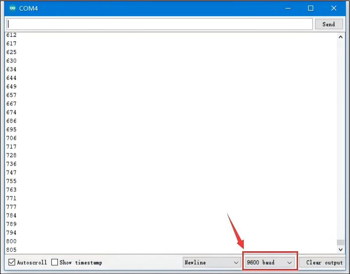

# 2. Arduino Development


## 2.1 Getting Started

### 2.1.1 Wiring Instruction

This section illustrates connecting a 4-pin cable to the A2 and A3 ports on the Arduino expansion board. Refer to the diagram below.



If you do not have an Arduino expansion board, use a Dupont wire to directly connect to the Arduino development board, just as below:



> [!NOTE]
>
> * When using Hiwonder's lithium battery, connect the battery cable with the red wire to the positive (+) terminal and the black wire to the negative (–) terminal of the DC port.
>
> * Before connecting the battery cables, make sure they are not already attached to the lithium battery. This prevents the risk of a short circuit caused by accidental contact between the positive and negative wires.
>
> * Before powering on, ensure that no metal objects are touching the controller. Otherwise, the exposed pins at the bottom of the board may cause a short circuit and damage the controller.

### 2.1.2 Environment Configuration

You can install the Arduino IDE on a PC. Download path: **"[Appendix-> Arduino Installation Package](https://drive.google.com/drive/folders/1DeoB8ltvQaxljaKd5mmlCzMYmq35Eo46?usp=sharing)."** For more information, please refer to the same directory.

## 2.2 Test Case

Program to display the knob sensor value in the terminal window and control the module by setting a threshold.

###  2.2.1 Program Download

1. For the Arduino and UNO development board equipped with the expansion board, use a USB cable to connect them to the computer. You can open Arduino IDE, click **"File → New"** and import the program located in the same directory as this tutorial.

2. Remember to select the correct development board and port. The ports shown below are for reference only. Then compile and upload the program.



3. After the code is uploaded, click  to open the serial monitor, set the baud rate to 9600 to observe the output.

### 2.2.2 Project Outcome

Rotate the potentiometer on the sensor to observe the data changes on the monitor displays. Rotate the knob clockwise to increase the displayed value; rotate it counterclockwise to decrease the value.



### 2.2.3 Program Brief Analysis

- **Custom interfaces**

```py
#define KNOB A2   //Define the touch sensor signal pin connected to the control board's analog port A2
uint16_t knob_value;
```

First, program to define the interface of the knob sensor, and connect ADC to A2, knob_value is used to store the collected value.

- **Serial Port Initialization**

```py
void setup()
{
 Serial.begin(9600);
 pinMode(KNOB, INPUT);
}
```

After initializing the serial port, set the KNOB pin to INPUT mode.

- **Loop Process**

```py
void setup()
{
  knob_value = analogRead(KNOB); //Range 0-1023
  Serial.println(knob_value); //Serial port printing
  delay(500);
}
```

In the `loop()` function, read the ADC value from the A2 pin using `analogRead()` and store it in the `knob_value variable`, range 0–1023. Then print the value to the serial monitor.