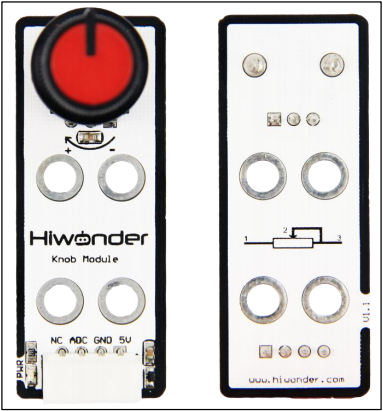
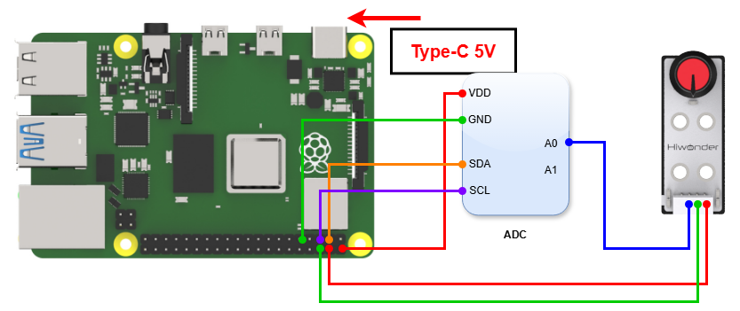
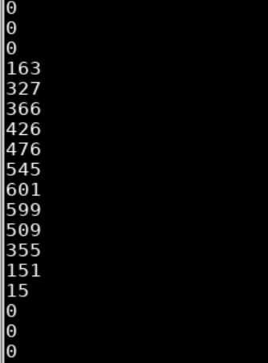

# 3. Raspberry Pi Development Tutorial



## 3.1 Getting Started

### 3.1.1 Wiring Instruction

This section uses DuPont wire to connect the knob sensor and the ADC digital-to-analog conversion module as an example. For wiring instructions, refer to the figure below:



> [!NOTE]
>
> * When using Hiwonder's lithium battery, connect the battery cable with the red wire to the positive (+) terminal and the black wire to the negative (–) terminal of the DC port.
>
> * If the battery is not connected to the cables, do not connect the cable ends directly together. Doing so may cause a short circuit and damage the system.

### 3.1.2 Environment Configuration

Install NoMachine on your computer. The software package is located under "**[Appendix-> Remote Desktop Connection Tool](https://drive.google.com/drive/folders/1S1ISuJqrP_uhE99ZSXjkiho6jkJoJ_jQ?usp=sharing)"**. For the detailed operations of NoMachine, please refer to the same directory.

> [!NOTE]
>
> **This example uses the ADS1115 external ADC module for demonstration. If you use other modules, you need to download the corresponding library file.**

In this example, you need to download the library file through pip. Make sure the Raspberry Pi is connected to the network, open a terminal window, and enter the following code:

```bash
sudo pip3 install Adafruit_ADS1x15
````

After installing the library file, open the terminal and enter the following command to switch to the directory where the program is located:

```bash
sudo chmod a+x Sensor_Demo/
```

## 3.2 Test Case

Program to display the knob sensor values in the Raspberry Pi terminal window and control the module by setting a threshold.

### 3.2.1 Program Download

1. Open the terminal and enter the following command to navigate to the program directory:

"**cd Desktop/Sensor_Demo/**" and press Enter.

```bash
cd Desktop/Sensor_Demo/
```

2. Run the program by entering:

"**python3 KnobsSensorDemo.py** "

```bash
python3 KnobsSensorDemo.py
```

### 3.2.2 Project Outcome

Rotate the potentiometer on the sensor to observe the data changes on the monitor displays. Rotate the knob clockwise to increase the displayed value; rotate it counterclockwise to decrease the value.



### 3.2.3 Program Brief Analysis

- **Import Libraries**

```py
import time
import Adafruit_ADS1x15
```

Import required library files, including Adafruit_ADS1x15, the external **ADC** module library.

Since the Raspberry Pi does not have an ADC converter, you need to use an external ADC conversion module to realize AD conversion. In this example, the ADS1115 module is used for demonstration, and you can use any ADC module based on your needs.

- **Initialization Sequence**

```py
adc = Adafruit_ADS1x15.ADS1115()
adc = Adafruit_ADS1x15.ADS1015(address = 0x48, busnum = 1)
```

Instantiate the adc object and initialize the interface converted by the adc object to port A1.

- **Main Program**

```py
while True:
  value = adc.read_adc(1,gain=GAIN)
  print(value)	
  time.sleep(0.3)
```

In the while loop, store the value read from the ADC object in the value variable and print it to the terminal.